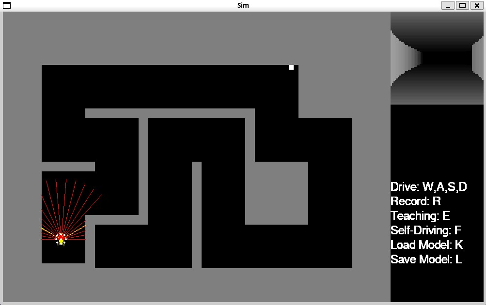
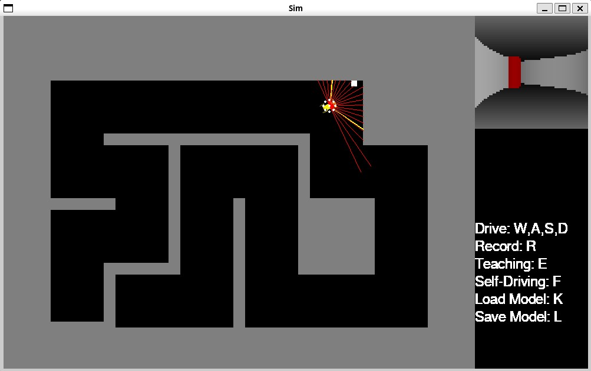
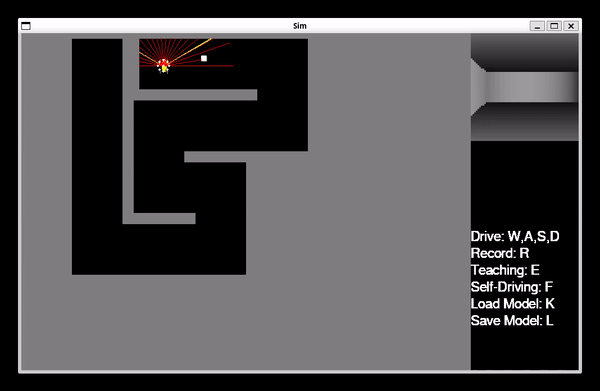
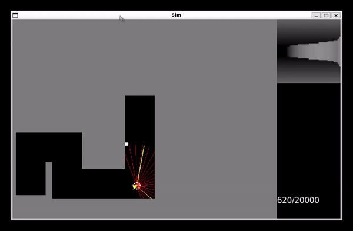

# Autonomous Navigation in Complex Environments
A Deep Learning project implementing CNN-DNN fusion for autonomous robot navigation in subterranean environments.

Arxiv paper link: [https://arxiv.org/abs/2401.03267](https://arxiv.org/abs/2401.03267)

Team Members:
- Andrew Gerstenslager
- Liam McKenna
- Poorva Patel
- Jomol Lewis

## Description
This project implements an autonomous navigation system using a fusion of Convolutional Neural Networks (CNN) and Deep Neural Networks (DNN) to navigate complex subterranean environments. The system is designed to:
- Process both LiDAR and camera data for environmental perception
- Use imitation learning to develop navigation strategies learned from recorded human data
- Find goals in unknown cavernous environments
- Demonstrate robustness through Monte-Carlo testing

### Key Features
- Dual-mode operation (Manual/Autopilot)
- Real-time sensor fusion
- Imitation learning capabilities
- Model persistence (save/load functionality)
- Monte-Carlo based robustness testing


### Component Details
- **main.py**: Core application file
  - Manages simulation environment
  - Handles manual control mode for data collection
  - Implements autopilot mode for model testing
  - Provides model save/load functionality

- **successtest.py**: Testing framework
  - Implements Monte-Carlo testing
  - Evaluates model robustness
  - Generates performance metrics

- **Neural Network Architecture models/robot_model.py**:
  - CNN: Processes visual data from cameras
  - DNN: Processes LiDAR point cloud data
  - Fusion Layer: Combines CNN and DNN outputs
  - Control Head: Generates navigation commands

## Requirements
- Python 3.8+
- TensorFlow
- NumPy
- OpenCV
- PyGame (for simulation environment)
- Additional dependencies in requirements.txt

## Usage

### Running the Simulation
1. Launch the environment:
```bash
python3 main.py
```





### Operation Modes
1. **Manual Mode**:
   - Used for data collection and demonstration
   - Control using keyboard inputs:
     - W/S: Forward/Backward
     - A/D: Turn Left/Right
     - Q: Quit
     - M: Switch to autopilot mode

2. **Autopilot Mode**:
   - Tests the trained model
   - Automatically navigates environment
   - Press 'M' to switch back to manual mode

### Model Management
- Save current model: Press 'S' during simulation
- Load existing model: Press 'L' during simulation

### Manual Driving in main.py:



### Testing
Run Monte-Carlo testing suite:
```bash
python successtest.py
```
Successtest will:
- Load a pre-trained model
- Run multiple navigation attempts in randomly generated environments
- Generate success rate statistics

### Performance Metrics
The system tracks:
- Navigation success rate
- Average completion time
- Collision incidents
- Path efficiency

### Pre-trained Model
A pre-trained model is included in the repository and has been verified to work with successtest.py.

### successtest.py running:


